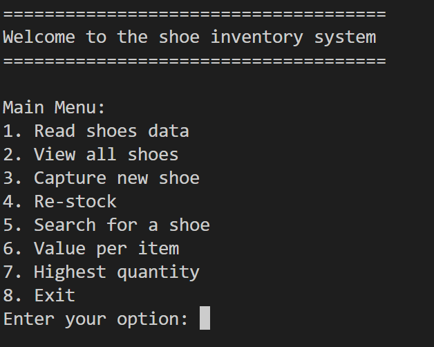
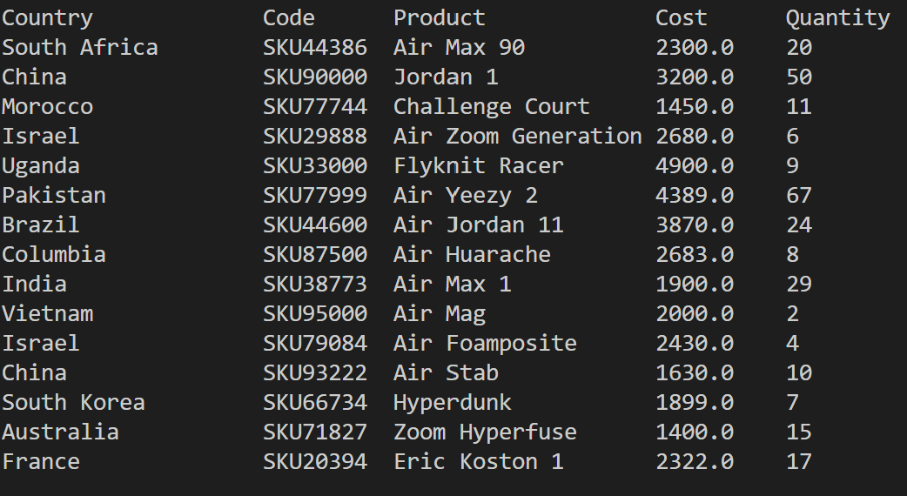

# Final Capstone Project

## Table of contents

## Desctiption

The program is to help manage inventories using text files.

## How to install

Download both files `inventory.py` and `inventory.txt` and run in Python `inventory.py` file.

## Usage

After running `inventory.py` you will see main menu.
You can choose to:

- read shoes data from the file
- view all shoes data
- create new shoes
- re-stock particular shoe
- search for a shoe using code
- calculate values per item
- find highest quantity item

## Screenshots

1. Main Menu:

2. View All shoes data:

